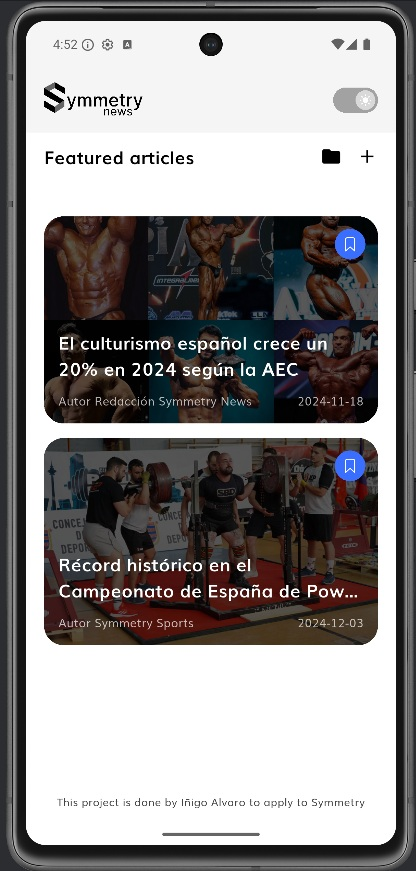
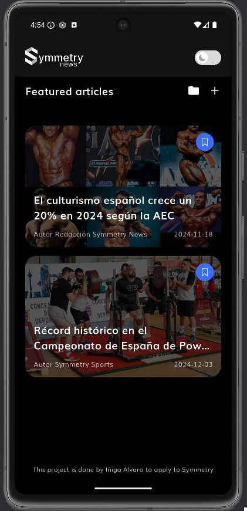
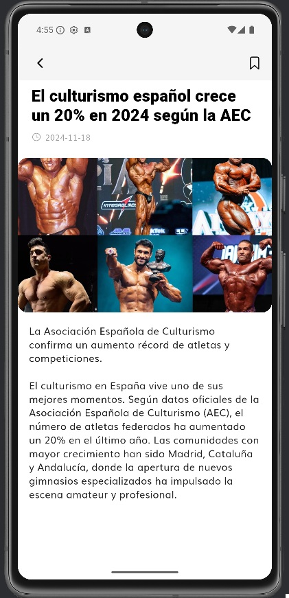
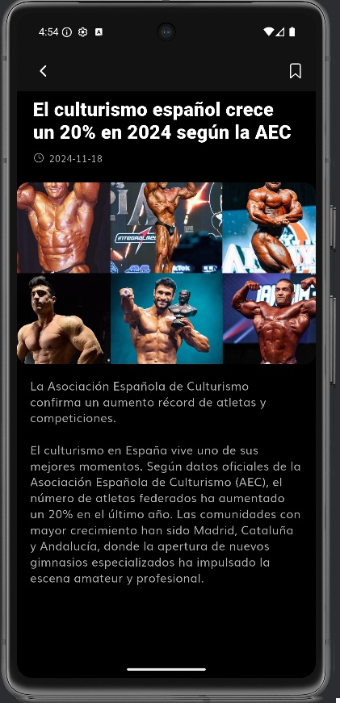
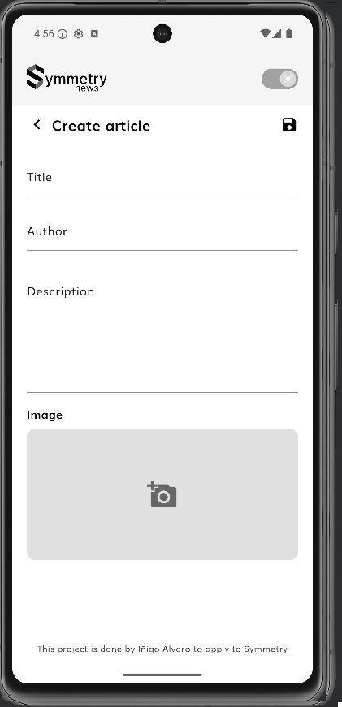
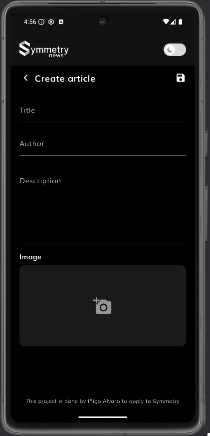
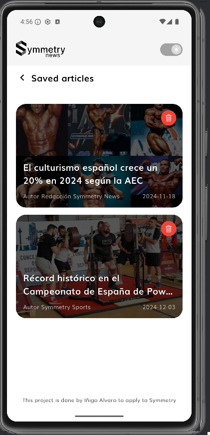
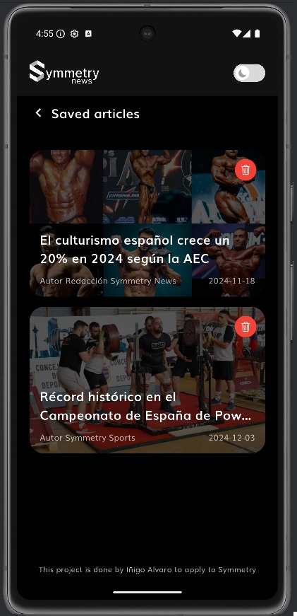
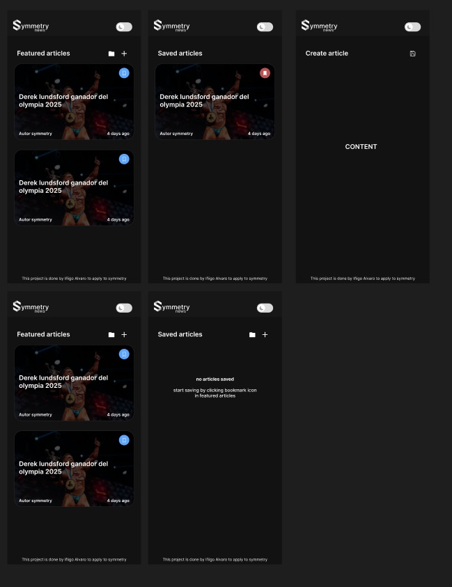
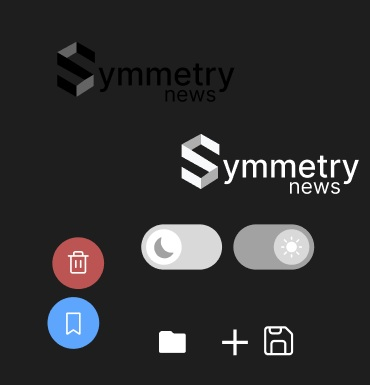

### 1. Introduction
When I started working on the Symmetry Showcase App challenge, my first feeling was a mix of excitement and uncertainty. Although I have previous experience developing applications — I began with web development courses (HTML, CSS, JavaScript and later React) and eventually created my own app, EasyWorkout  but  this project felt different.
EasyWorkout originally started as a web app, and over time I migrated it to Flutter while learning Dart along the way. Still, Symmetry’s challenge was my first opportunity to apply a professional architecture, follow strict guidelines, and build something that had to be clean, maintainable, and aligned with industry standards. It felt like the perfect scenario to prove how fast I can adapt and learn.

### 2.Learning Journey
Before this challenge, my app followed a structure “close” to Clean Architecture, but not as strict as Symmetry’s version. My own project has no backend, only Drift as a local database, so working with repositories, data sources, and a simulated backend was completely new to me.
I also had never used BLoC, so I watched the course attached in the repository and the Clean Architecture explanation video to learn how to correctly structure my domain, data, and presentation layers. During the process, I also studied the official documents — Architecture Violations, App Architecture, and Coding Guidelines — which helped me understand the level of discipline required and how careful each layer must be with its responsibilities.
Another important part of my learning was improving the structure of the presentation layer. Before this project, most of my UI code was written inside large build methods. In this challenge, I learned to organize my Flutter screens using private widget builder methods (e.g., _buildFooter(), _buildHeader(), _buildArticleCard()), which made the UI clearer, more modular, and easier to maintain.

### 3. Challenges Faced
One of the first challenges I faced was related to environment setup. The project template included a very old Flutter version, and several dependencies were outdated or deprecated. Because of that, I decided to create a completely new Flutter project from scratch and migrate all the files into a stable environment. This took extra time, but it ensured that I would not be slowed down by version issues later on.
Another major challenge was how to simulate the backend. At the beginning, I tried to emulate a full backend using a local .json file. This sounded simple at first, but it quickly became complicated: I had to change the way data sources worked, modify parts of the repositories, adjust the models, and restructure some of the logic because a static JSON did not behave like a real backend. After several attempts, I realized that I was forcing the architecture in a direction that was not ideal.
In the end, I decided to use Firebase as the backend. This was practically my first real experience with backend development in my professional career, but thanks to the tutorial included in the repository, setting up Firestore and connecting it to Flutter turned out to be much easier than expected. Once the data layer was working correctly, the rest of the challenge flowed much more naturally.
My overdelivery was focused mainly on UI and design, which for me was the easiest and most enjoyable part. Since I already had experience building and styling interfaces from my previous projects, it felt familiar and allowed me to bring something extra to the challenge.

### 4. Reflection and Future Directions
Working on this project has been a genuinely cool and eye-opening experience. It made me realize how many things in my previous apps could be improved at an architectural level — from how files are organized, to how responsibilities are separated, to how easy it becomes to maintain and debug when everything follows a clear structure.
One of the biggest takeaways for me was learning how BLoC really works. Thanks to the “BLoC from Zero to Hero” course, I finally understood state management in a professional way, and how blocs, events, and states interact with use cases to keep the UI clean and predictable.
I also had the opportunity to work with a real backend for the first time. Using Firebase and Firestore helped me understand how data flows from an external source into the architecture, how repositories and data sources fit together, and how powerful it is to work with a proper backend instead of local JSON files.
Another important improvement in my workflow was learning how to properly structure Flutter UI using private widget builder methods. Before this project, most of my code was written inside large build() methods, but now I understand how splitting the UI into smaller private methods makes the code easier to read, more modular, and more maintainable.
Looking ahead, I want to keep improving my skills in architecture, backend, and state management. This challenge has shown me how much cleaner and more scalable my future apps can become by applying these principles from the beginning.

### 5. Proof of the project.
Here you would be able to see how my projects looks.

### Notes  
- All screenshots were taken from the final working build.  

### 6. Overdelivery

Throughout the development of the project, I wanted to go beyond the initial requirements and add extra features and design improvements that demonstrated my creativity, my attention to detail, and my ability to apply Clean Architecture principles in a more complete way. Below are the enhancements I implemented and the prototypes I created.

### 6.1 New Features Implemented
• Light & Dark Theme Support (with ThemeCubit)
One of the main additions I implemented was full support for light and dark themes.
To manage this dynamically and in a clean way, I created a ThemeCubit, which allows the UI to react instantly to theme changes while keeping the presentation layer well-organized.
Theme switching was not part of the original challenge, so implementing a dedicated cubit for this counts as overdelivery.

• Home, Saved Articles and Create Article Screens Built From Scratch

Beyond the required basic home screen, I designed and implemented three complete UI screens from zero:
- New Home Layout
- Saved Articles Screen
- Create Article Screen

I first sketch each screen in Figma, planning the structure, spacing, color hierarchy and user flow before building them in Flutter.
I also created some of the icons myself to better match the visual style I wanted.

These screens were entirely optional, but they helped me showcase my strengths in UI/UX and gave the project a more complete and polished appearance.

### 6.2 Prototypes Created

• Figma sketches preview
Before coding the new screens, I created a layout in Figma to plan the interface visually.
Due to time constraints, I could not complete a full high-fidelity interactive prototype, but the design mockup is clear and easy to extend in the future.

and the icons:

### 6.3 How Can I Improve This

If I had more time, I would continue expanding the overdelivery with:

- Creating a complete high-fidelity Figma prototype with animations and interactions
- Adding transitions and small motion design details to improve the UX
- Implementing search, categories and filtering in the home screen
- Building a small design system (colors, spacing, typography) documented inside /docs

These improvements would elevate the project even further and transform the prototypes into fully functional features.

### 7. Extra Sections:

### 7.1 Personal Strengths and What I Can Contribute

One of the areas where I believe I can contribute the most is in UI design and visual organization.
I genuinely enjoy creating interfaces that feel clean, modern, and intuitive, and throughout this challenge I was able to apply those skills while respecting a strict architecture. Designing screens from scratch in Figma, building consistent layouts, and ensuring visual clarity are things I naturally focus on and would love to bring to a professional environment like Symmetry.

At the same time, this project reinforced my motivation to continue improving as a multiplatform developer.
Working with Clean Architecture, BLoC, Firestore, and structured theming has helped me understand what building scalable apps really means. I want to keep learning, improving as a Flutter developer, and mastering backend integrations and architectural patterns.

### 7.2 Git Flow Usage

During the entire project, I followed the GitFlow workflow to simulate a real production environment.
This included creating a new branch for every feature, merging all completed work into the develop branch, and finally preparing the final version through a pull request into main.

The workflow I used was:

feature/xxx → where I built individual features

When a feature was completed:
➝ merge into develop

Once the project was ready for delivery:
➝ pull request from develop to main

This helped me organize my work, isolate changes, and maintain a clean, professional commit history—similar to the workflow used in real companies.